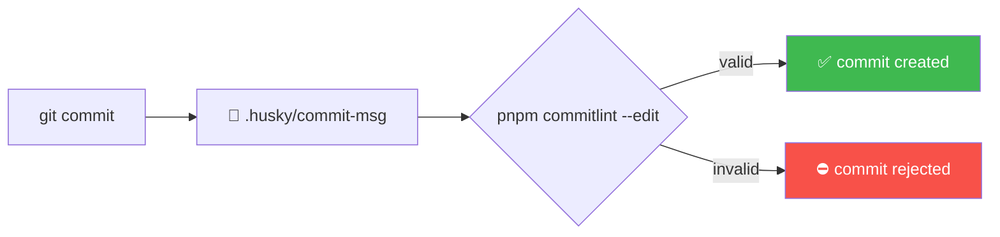
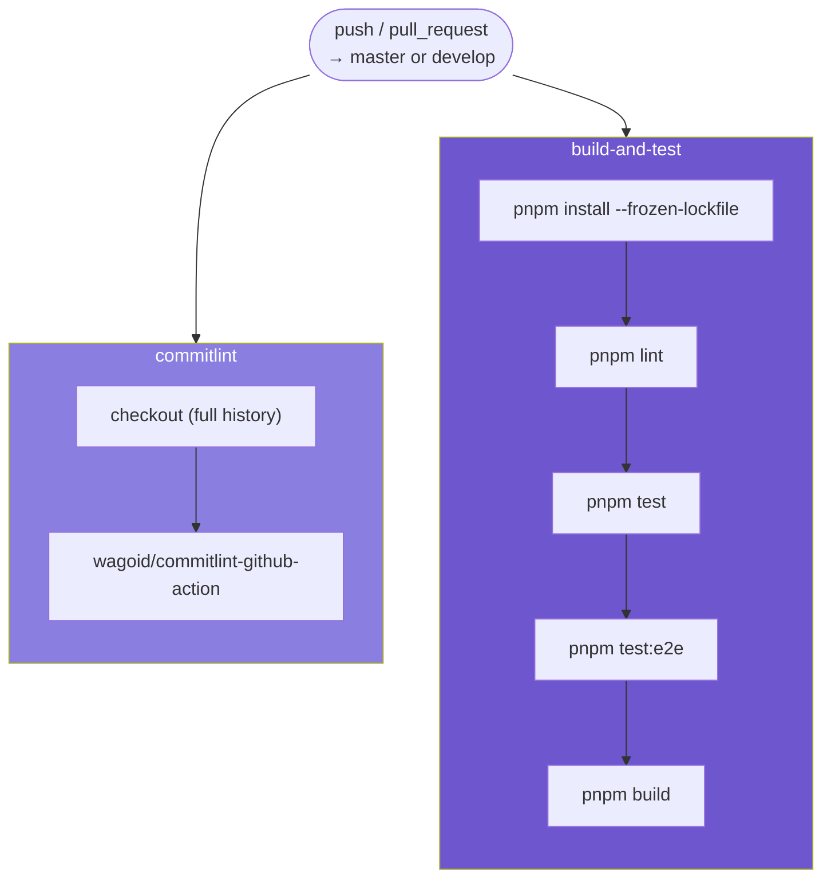

# 🚦 CI and commit rules

Two independent systems enforce quality here: **Husky** (runs locally,
before a commit is even created) and **GitHub Actions CI** (runs on every
push/PR).

**On this page:**
[Commit messages](#-commit-messages-husky--commitlint) ·
[GitHub Actions CI](#-github-actions-ci) ·
[Run it locally](#-run-the-same-checks-before-you-push)

---

## ✍️ Commit messages: Husky + commitlint

This repo uses [Conventional Commits](https://www.conventionalcommits.org/)
(`@commitlint/config-conventional`, configured in
[`commitlint.config.js`](../commitlint.config.js)):

```
<type>(<optional scope>): <description>

feat: add change-password use case
fix(identity): reject expired JWT on authenticate
docs: add architecture walkthrough
chore: bump nestjs to 11.0.2
```

Common types: `feat` `fix` `docs` `chore` `refactor` `test` `ci`.



**Locally**, [`.husky/commit-msg`](../.husky/commit-msg) runs
`pnpm commitlint --edit "$1"` on every `git commit`. A message that doesn't
match the convention **blocks the commit outright** — it's rejected before
it ever reaches your local history, not just flagged.

This only runs if Husky's hooks are installed, which happens automatically
via the `prepare` script (`pnpm install` runs it for you).

## 🔁 GitHub Actions CI

Defined in [`.github/workflows/ci.yml`](../.github/workflows/ci.yml), it
triggers on `push` and `pull_request` targeting `master` or `develop`. Two
jobs, running in parallel:



### `commitlint`

Re-checks every commit in the push/PR range with
`wagoid/commitlint-github-action`. This exists as a safety net even though
Husky checks locally — Husky can be skipped (`--no-verify`, or a commit made
somewhere Husky isn't installed), CI is the check that can't be bypassed.
Needs full git history (`fetch-depth: 0`) to see the whole commit range, not
just the latest commit.

### `build-and-test`

Runs on Node 22 with pnpm, in this order:

```bash
pnpm install --frozen-lockfile
pnpm lint
pnpm test
pnpm test:e2e
pnpm build
```

`--frozen-lockfile` fails the install if `pnpm-lock.yaml` is out of sync with
`package.json` — catches a dependency added without committing the updated
lockfile.

A dummy `JWT_SECRET` env var is set for this job — only `pnpm test:e2e`
actually boots the full app (via `ConfigModule`'s startup validation, see
[`environment-variables.ts`](../src/shared/infrastructure/config/environment-variables.ts)),
and nothing in CI talks to a real token consumer, so a fixed dummy value is
safe and reproducible.

## ⚡ Run the same checks before you push

```bash
pnpm lint
pnpm test
pnpm test:e2e
pnpm build
```

> ✅ If all four pass locally, CI's `build-and-test` job will pass. Fix your
> commit messages as you go — Husky already blocks a bad one at commit time,
> so if you never bypassed it with `--no-verify`, the `commitlint` job will
> pass too.

---

⬅️ Previous: [Adding a Feature](./03-adding-a-feature.md) &nbsp;·&nbsp;
🏠 Back to [Documentation index](./README.md)
